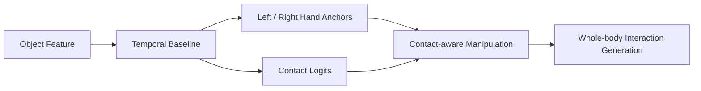

<!-- Profile README for Yukun-Zheng -->

<div align="center">


[](https://git.io/typing-svg)

<a href="https://yukun-zheng.github.io"></a>
<a href="https://github.com/Yukun-Zheng"></a>
<a href="mailto:zhengyukun2005@gmail.com"></a>
<a href="https://orcid.org/0009-0004-8711-8817"></a>

</div>

---

## 🧭 About Me

I am **Zheng Yukun**, a Computer Science undergraduate at **Shenzhen University**, focusing on **Embodied AI**, **Human-Object Interaction**, and **motion generation for manipulation**.

My current research interest is centered on:

- **Whole-body human-object interaction**: body + hand + object motion understanding and generation.
- **Contact-aware manipulation**: hand anchors, contact states, object-conditioned interaction targets.
- **Motion generation systems**: from geometric contact caches and baseline models to richer interaction generation.
- **Research engineering**: datasets, reproducible pipelines, evaluation scripts, visualization, and AI-assisted research tools.

<div align="center">

```text
Object motion  ──►  contact reasoning  ──►  hand anchors  ──►  body-hand-object interaction
```

</div>

---

## 🔬 Research Focus

<table>
  <tr>
    <td width="33%" valign="top">
      <h3>🧍 Whole-body HOI</h3>
      <p>Human-object interaction with body pose, hand motion, object state, and contact structure.</p>
    </td>
    <td width="33%" valign="top">
      <h3>🖐️ Contact & Anchors</h3>
      <p>Contact-aware hand-anchor targets, object-conditioned local coordinates, and manipulation signals.</p>
    </td>
    <td width="33%" valign="top">
      <h3>🤖 Embodied Generation</h3>
      <p>Motion generation, task-oriented interaction, and future closed-loop embodied manipulation.</p>
    </td>
  </tr>
</table>

---

## 🧰 Tech Stack

<div align="center">

### Languages & Core Tools


### AI / Research Engineering


</div>

---

## 🚧 Current Direction



I am currently interested in building compact but verifiable baselines before moving toward heavier generative systems:

- input: object position, rotation, velocity
- output: left / right hand local anchors and contact logits
- objective: validate dataset reading, training stability, checkpointing, evaluation, and visualization

---

## 📌 Selected Project Entry Points

<div align="center">

| Area | Description | Link |
|---|---|---|
| Personal Website | Animated research portfolio | [yukun-zheng.github.io](https://yukun-zheng.github.io) |
| GitHub Profile | Code, notes, and research engineering | [Yukun-Zheng](https://github.com/Yukun-Zheng) |
| ORCID | Academic identity | [0009-0004-8711-8817](https://orcid.org/0009-0004-8711-8817) |

</div>

---

## 📊 GitHub Analytics

<div align="center">


<br />
<br />


</div>

---

## 🐍 Contribution Graph

<div align="center">

<picture>
  <source media="(prefers-color-scheme: dark)" srcset="https://raw.githubusercontent.com/Yukun-Zheng/Yukun-Zheng/output/github-contribution-grid-snake-dark.svg" />
  <source media="(prefers-color-scheme: light)" srcset="https://raw.githubusercontent.com/Yukun-Zheng/Yukun-Zheng/output/github-contribution-grid-snake.svg" />
  
</picture>

</div>

---

## 📫 Contact

<div align="center">

**Email:** [zhengyukun2005@gmail.com](mailto:zhengyukun2005@gmail.com)  
**University Email:** [2023150022@email.szu.edu.cn](mailto:2023150022@email.szu.edu.cn)  
**Website:** [https://yukun-zheng.github.io](https://yukun-zheng.github.io)

</div>

<div align="center">


</div>


